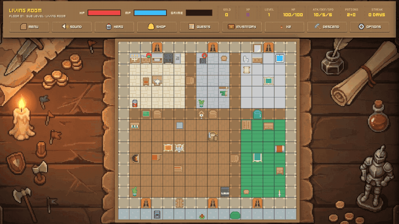
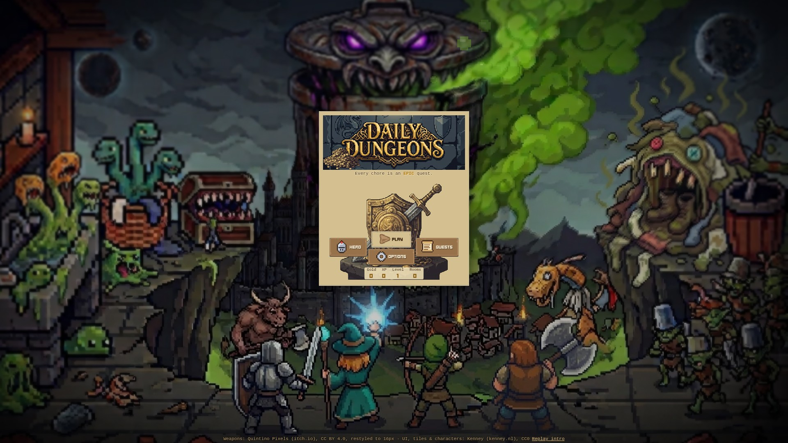
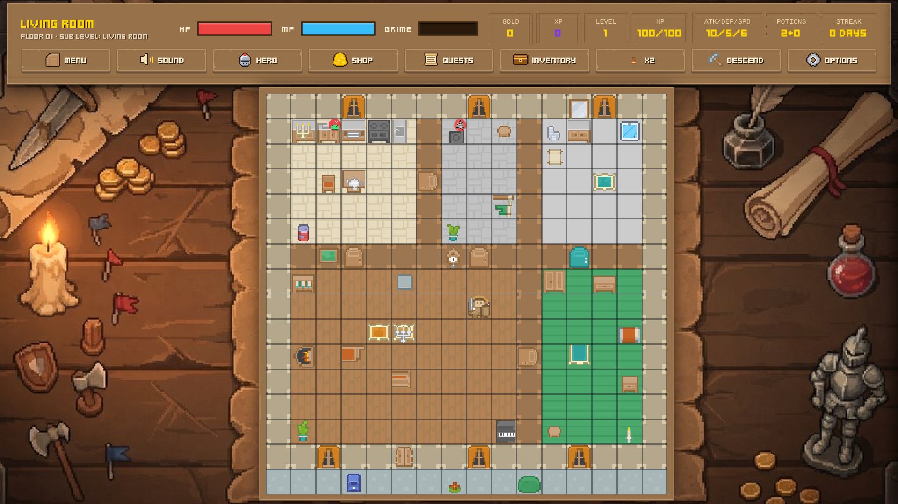
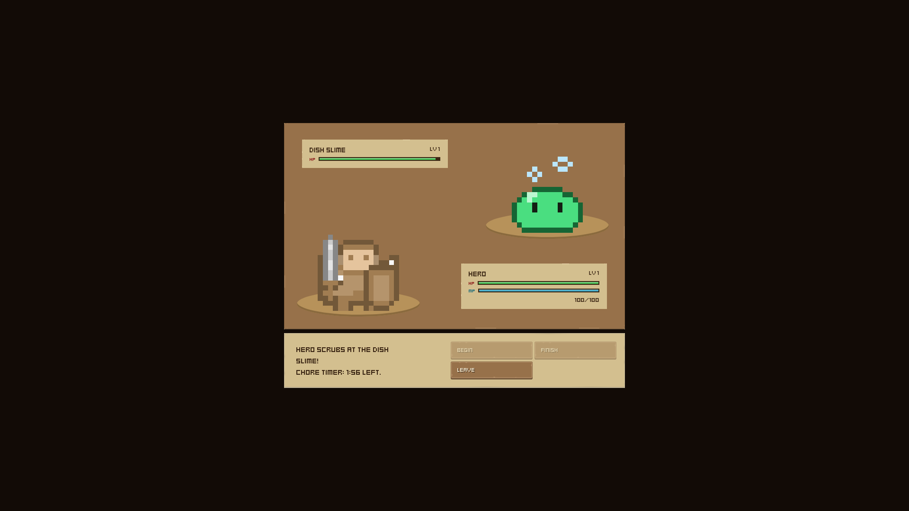
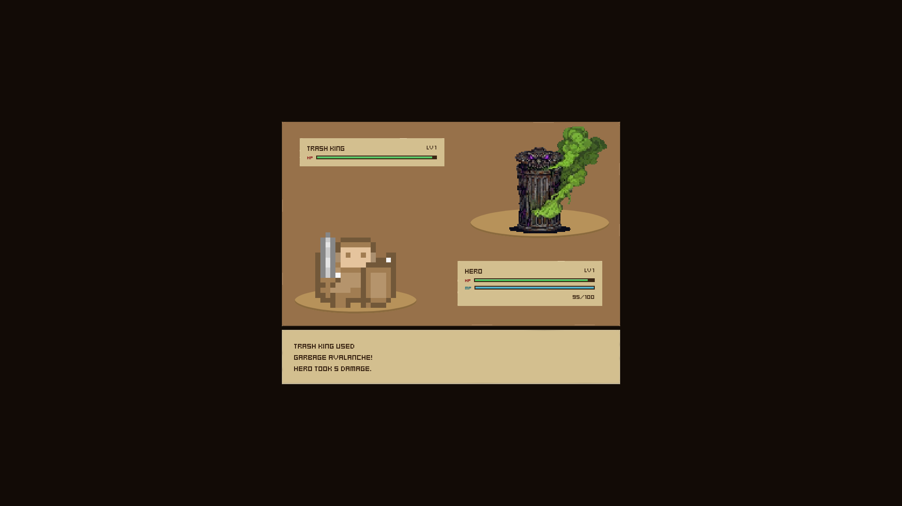

# DailyDungeons

*Every chore is an EPIC quest!*

**[PLAY NOW in your browser](https://mndwrx.github.io/DailyDungeons/)** (no install, works on desktop and phone)



> Hear ye, Hearth Keeper! The Trash King below has cast the Grime Curse, and every neglected chore twists into a monster. Take up your broom, choose your quest, and set your home to rights. The Elder Wizard is watching. Kindly.

## The Scroll of Summary (writeup, 440 characters)

DailyDungeons turns real chores into an idle 8-bit RPG. Pick a quest like dishes, laundry or trash, and your hero walks to it and battles a matching monster for as long as the real chore takes. Hit Begin, do the chore, hit Finish, and collect loot. Win gold, gear and XP, shop for upgrades, and level up. Slack off and the Grime Curse builds until the Trash King, Grime Hydra or Dust Wraith rise in the Sunken Cellar. It runs on any screen.

## Visions from the Crystal Ball (screenshots)

| Start menu | Play screen on the war table |
|---|---|
|  |  |
| **Chore battle** | **Trash King fight** |
|  |  |

## The Way of the Hearth Keeper (how to play)

Listen well, young one. The rules are few:

- **Quests:** Open **Quests** to see today's chores (dishes, laundry, trash and more). Pick one and your hero walks to the matching monster in your house.
- **Begin / Finish:** In the chore battle, press **Begin**, then go do the real chore. The battle runs for as long as the chore takes. Press **Finish** when you are done to land the final blow.
- **Loot:** Each win pays out gold, XP and sometimes gear or potions. Level up to grow stronger.
- **Shop:** Spend gold in the **Shop** on weapons, shields, enchantments and talismans. Check your gear in **Inventory**.
- **Grime Curse:** Skip your chores and the Grime bar fills. Monsters lurk in the rooms, and your daily streak breaks.
- **Bosses:** Let the curse grow and the Trash King, Grime Hydra or Dust Wraith rise in the Sunken Cellar below. **Descend** to face them in turn-based battle.
- **Options:** Music volume, sound effects volume and Mute all live in **Options**.

## Summoning the Game at Home (run locally)

The game is a single `index.html` with an `assets/` folder. No build step.

1. Download or clone this repository.
2. Open `index.html` in a browser, or serve the folder with any static server, for example:
   ```
   python3 -m http.server 8000
   ```
   then open port 8000 on your own machine in the browser.

Your progress is saved in the browser's local storage.

## The Wizard's Confession (model declaration)

Code was written with Grok Bot, an AI assistant, based on my design and direction. Pixel art comes from Kenney packs (CC0) and Quintino Pixels weapons (CC BY 4.0), plus custom monster, logo and background art I generated from my own prompts with Gemini and Grok Imagine. Backgrounds were removed with remove.bg, and Grok Bot cleaned up the edges, then resized and placed the art in the game.

Music and sound effects are original, generated in code for this project.

## The Roll of Honor (credits and license)

- Art, fonts and other third-party credits: see [CREDITS.md](CREDITS.md).
- License: [MIT](LICENSE).
